## Task_Python_Docker Repo
---
### **Overoll Actions:**
1. Web Server running on **port 5000** with **host 0.0.0.0**. For Web Server was used such python modules like: **Flask, json, and BaseConverter from werkzeug.routing** for using REGEX in app.route. It also returns "HTTP 200 OK" on URL "/healthcheck" (python), returns "HTTP 404" on other URLs. **Then pushed to repo.**
2. To run the app, use this command: **```python3 main.py```**. Then functionality was tested:
**Starting Server Before Docker Step:**
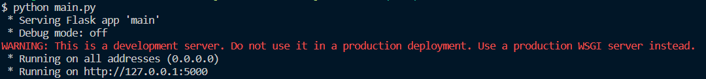

**Server response 200 status code:**
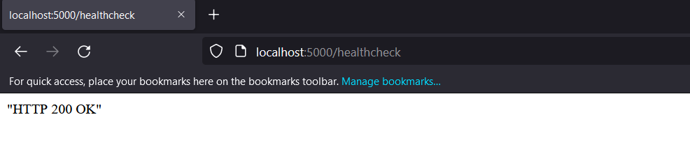

**Server response 404 status cod, to all other url requests:**
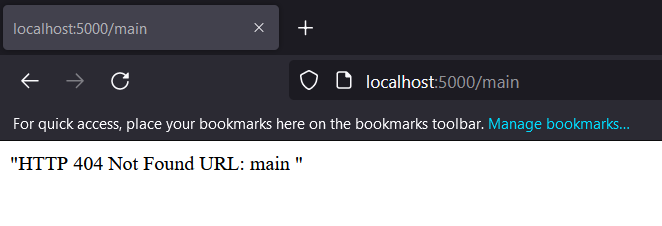

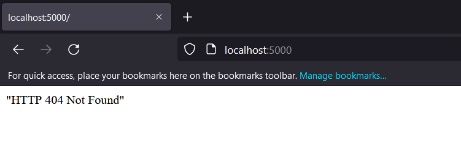

3. **Dockerfile** was created using **python:3.8-slim-buster** as a base image. I am exposing port 5000, to have the ability to access responses from server. Next, I am creating work folder and using **COPY** copy main.py, requirements.txt files, where first one will be used for running server; second one used for installing dependencies for image. In the end, used  **CMD** to run **app.py**(everytime container starts it will start from this command, thanks to this app will run.). **requirements.txt** was created by this command ```pip3 freeze | grep Flask >> requirements.txt```, **freeze** output installed packages in requirements format, as I used only 1 external module(**Flask**), I am installing only that module.

```
FROM python:3.8-slim-buster
MAINTAINER Teranteks

EXPOSE 5000

RUN mkdir /app
WORKDIR /app

COPY ./main.py /app/app.py
COPY ./requirements.txt /app/requirements.txt

RUN pip3 install -r /app/requirements.txt

CMD [ "python3", "./app.py"]
```

4. Then I created dockerhub repo for docker image, after that in console **login in docker hub** using ```docker login```, and enter **Username, Password** from dockerhub. Later, I built a docker image using ```docker build ./ -t teranteks/test_task_python_webserver:v1``` and named image with name of repo, set tag **version1**.

5. The next step was to test the image. I created a container with this command ```docker run -d --name python_app -p 5000:5000 teranteks/test_task_python_webserver:v1``` and made requests to test functionality of app.py. After success pushed it to dockerhub repo ```docker push teranteks/test_task_python_webserver:v1```

6. I pulled image from dockerhub repo (**It is public repo, check url: https://hub.docker.com/r/teranteks/test_task_python_webserver .**). Run ```docker run -d --name python_app -p 5000:5000 teranteks/test_task_python_webserver:v1``` command again and check, how everything works.

**Docker Container/Images:**
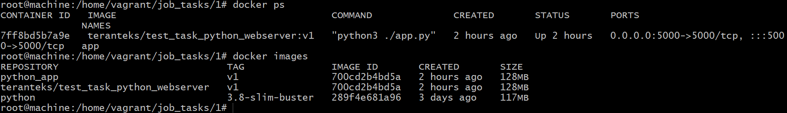

### **The responses from the server are the same as in step 2. Check that step.**

---

## **Helm Chart**
1. Create cluster by ```minikube start --cpus=4 --memory=4gb --disk-size=20gb``` 
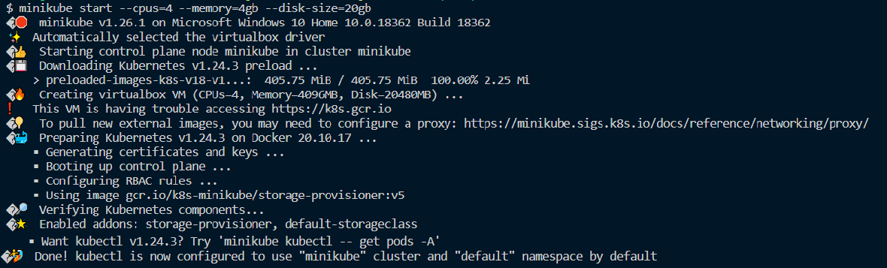
2. Then, I created a helm chart named **"WebServer_Helm"** with files like Chart.yaml, values.yaml and folder with autoscaling.yaml, deployment.yaml, service.yaml. As you can see, I set **HorizontalPodAutoscaler**, to decrease the chances of downtime (or minimize it).

3. Run command ```helm install app WebServer_Helm/```, and deployment, service, autoscaling is created by one command, because of Helm Chart.
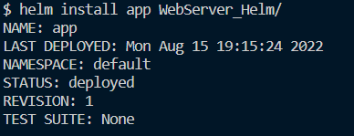
4. Here you can see **working cluster, deployment etc...**
# k8s deploy:
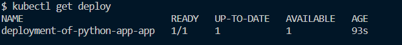

# k8s hpa:
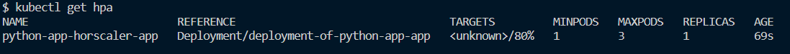

# k8s pods:
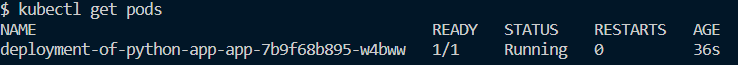

# k8s svc:
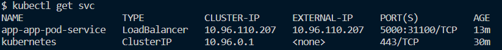

# Responses:
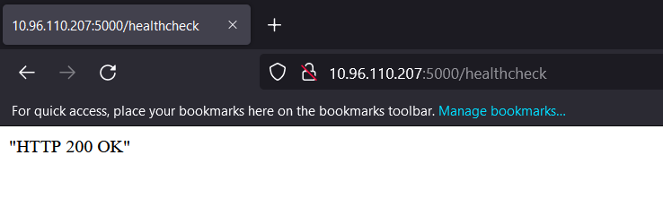

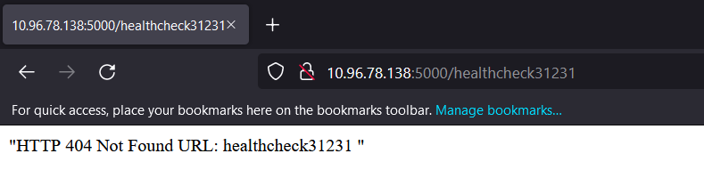

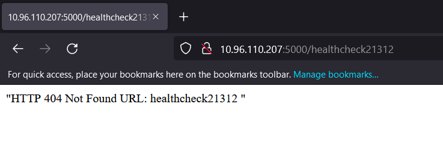

# **All values, vars were deployed for demonstration; in other cases they will be in .gitignore file.**

